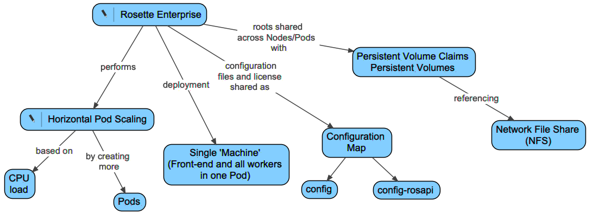

# Rosette Enterprise k8s Persistent Volume Deployment
## Overview
This example describes how to setup and run Rosette Enterprise with the roots hosted on an NFS server. The key components of the deployment are outlines in Figure 1.

The Rosette Enterprise image specified in the deployment will be deployed in 'single-machine' mode with the front-end and workers all running in one Pod. Horizontal Autoscaling will be handled by a Horizontal Pod Autoscaler using CPU load as a scaling metric. All configuration files and the Rosette License file will be exposed to Pods using two ConfigMaps. One ConfigMap encapsulates the ./config directory of Rosette Enterprise and the other config map encapsulates configuration files and license file found in ./config/rosapi. The NFS mount point is exposed using a Persistent Volume and Persistent Volume Claim.

This deployment of the Rosette Enterprise containers has the following advantages over the current deployment:
1. The containers can start up faster since they do not need to unpack roots.
2. The containers are smaller and will not exceed any Docker limit on container size.
3. The Persistent Volume is mounted on each Node in the cluster so all Pods will have access to the roots.

## Outline
The basic steps are:
1. Obtain a Rosette Enterprise license file.
2. Use the provided scripts to pull the configuration files from the Rosette Enterprise Docker image and configure them for your deployment.
3. If needed, create an NFS server virtual machine
   - includes copying roots to the VM
   - one time activity
4. Create k8s cluster
   - one time activity 
5. Use Helm to deploy your configuration to k8s.
   - Test the deployment.

This recipe has been validated on Google Kubernetes Engine but the concepts will be the same regardless.

### Obtain a Rosette Enterprise license file
The Rosette Enterprise license file or its location(rosette-license.xml) would have been part of your shipment email.

### Pull and Update Configuration
The Helm deployment will open the ./rosent-pv/config directory and create ConfigMaps from the files found there. Before deploying the `./scripts/setup-license-and-configmaps.sh` script is run and given the Rosette Enterprise Docker image and version that will be used for the deployment. It is recommended that the rosette-license.xml file location be provided at this time as well. The license file can be provided later but the deployment will fail if the license file is not part of the ConfigMap at template creation time.

In addition to the image and license file three other configuration parameters can be passed to `./scripts/setup-license-and-configmaps.sh` during setup.
|Flag|Meaning|
|----|-------|
|-i,--image|Required, Rosette Enterprise image to pull|
|-l,--license|Location of the rosette-license.xml file|
|-w,--worker|Number of worker threads to use. Default is 2|
|-p,--prewarm|true/false. Should the server be prewarmed at startup. Default is false|
|-u,--usageroot|Where usage tracking files should be placed in the container. Note do not use a directory written to by all Pods. Default `/var/tmp`|
|-h,--help|Print help and exit|
Once the configuration files are extracted from the image any custom configuration can be applied as usual for Rosette Enterprise For example, customization of factories can be done by updating configuration files in `./rosent-pv/config/rosapi/*.cfg`

#### Obtaining Roots
Roots are release specific and are released as either `.tar.gz` files as part of the shipment email or as Docker images. The simpliest way to obtain the roots is to download the `.tar.gz` files from the shipment email and unzip them into the `/var/nfsshare/roots' directory. A more labor intensive approach is to 
##### Determining the Root versions
Most roots can be determined by configuration files in the config directory. However some roots, TVEC and REX need to have a language associated with them which is only determined by licensing. In order to make the pulling of roots easier, without access to the shipment email a script, `./scripts/pull-roots.sh destination directory` was created. This script will read the `language.properties` file to determine which languages for REX and TVEC to pull. You must update this file to correspond to your licensed languages. Then running the `pull-roots.sh` script will parse the `com.basistech.ws.worker.cfg` file to determine the roots and versions that should be pulled. The docker images will be pulled and the `.tar.gz` containing the root will be extracted to the destination directory provided. Once extracted the `.tar.gz` files can be uploaded to the NFS server. For the example described below the roots should be extracted to `/var/nfsshare` for example `tar xvfz *.tar.gz -C /var/nfsshare/roots`. The roots should ultimately be placed in 
```
/var/nfsshare/roots/rex/<version>
/var/nfsshare/roots/relax/<version>
etc.
```
See the next section for more details about the example NFS server.

### Create NFS server virtual machine
This step is optional and is only required if an NFS server is not available in your environment. Please note, other file systems other than NFS can be used, however local attached storage should be avoided since local attached storage prevents moving Pods between Nodes. Please refer to the documentation on Persistent Volumes for more information. The concept for this example is that a virtual machine is created, started and then the roots are scp'd to the instance and served by NFS to all the Nodes in the cluster. Which roots to copy and where to find them will be described below.

A virtual machine is used since it more closely mimics NFS servers which are typically appliances or machines rather than containers. The VM created for the NFS Server in the Google Compute Engine was n1-standard-1 (1 vCPU, 3.75 GB memory) with an attached 150G disk to serve roots based on a centos-7 image. Note, there are some containerized NFS servers that could be used if a container is required.

#### Setup of the VM
  Once the VM instance is created and started, perform the following (one time setup)
##### Setup the directory for the roots:
```
sudo mkdir -p /var/nfsshare/roots
sudo chmod -R 755 /var/nfsshare/roots
sudo chown nfsnobody:nfsnobody /var/nfsshare/roots
# sudo expand [all the root files.tar.gz] to /var/nfsshare/roots
# Once expanded the path should look 
# similar to:
#   /var/nfsshare/roots/rex/7.45.0.c62.2 
#   /var/nfsshare/roots/rli/7.22.2.c62.2 
#   etc.
# Note the version numbers may differ.
```
##### Create an NFS Server:
Note systemctl typically doesn't run in a container which is another reason a VM was selected (ease of deployment):
```
sudo yum install nfs-utils

sudo systemctl enable rpcbind
sudo systemctl enable nfs-server
sudo systemctl enable nfs-lock
sudo systemctl enable nfs-idmap

sudo systemctl start rpcbind
sudo systemctl start nfs-server
sudo systemctl start nfs-lock
sudo systemctl start nfs-idmap

# expose the nfsshares
sudo vi /etc/exports
/var/nfsshare		*(rw,sync,no_root_squash,no_all_squash)
/var/nfsshare/roots	*(rw,sync,no_root_squash,no_all_squash)
sudo systemctl restart nfs-server
```
##### Allow the NFS traffic through the firewall:
```
sudo firewall-cmd --permanent --zone=public --add-service=nfs
sudo firewall-cmd --permanent --zone=public --add-service=mountd
sudo firewall-cmd --permanent --zone=public --add-service=rpc-bind
```
##### Verify NFS is serving:
`showmount -e localhost`

### Create k8s cluster
For the purposes of this test a three Node k8s cluster was created using Google Cloud Console. The cluster was named 'k8s-test-cluster` with each Node being of type custom N1, Container-Optimized OS, 2vCPU and 12G RAM

### Use Helm to Deploy Rosette Enterprise
In order to use Helm a few configuration values in the values.yaml file need to be set. These are described in the `rosent-pv` README as is how to test the deployment. Once configured the Rosette Enterprise can be deployed with  `helm install demo ./rosent-pv` from this directory.